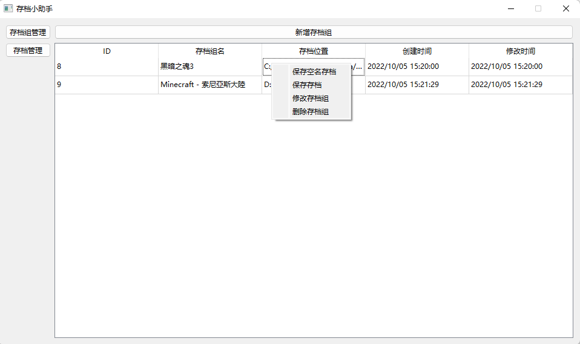
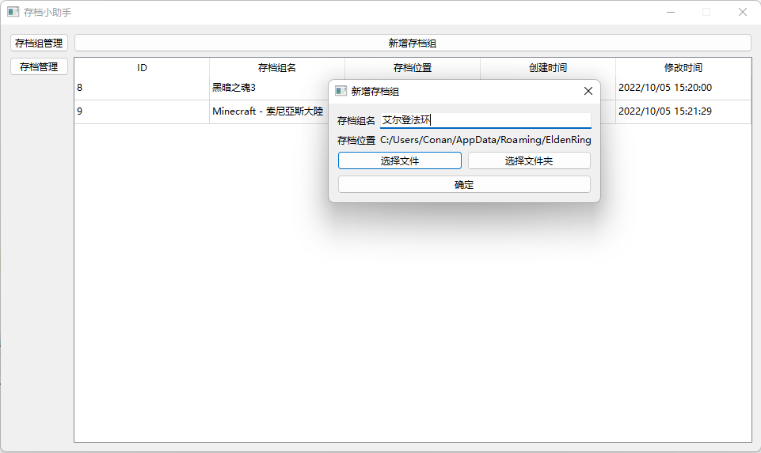
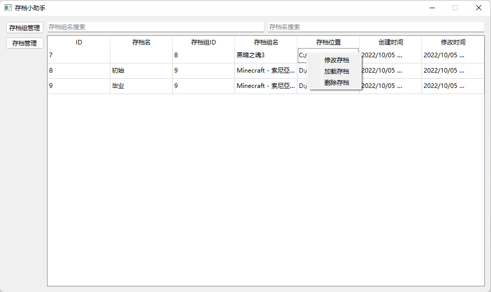

# 存档助手

## 简介

一些游戏实际是没有存档功能的，比如「Minecraft」、「艾尔登法环」等游戏。

本项目（存档助手）使用可视化的程序，可以帮助玩家更加便捷地去备份存档，无需联网且开箱即用。

可能界面功能做得不够完善，可在issue中提需求。

## 使用

Windows下提供exe文件打开即可使用，Mac下需要有python环境运行。

### Windows

在release中下载exe文件，打开即可使用。

### MacOS 或 源代码运行

- 需要安装python环境
- 编译：`pyinstaller -F -w -n backup-helper main.py`（编译产物位于dist文件夹中）
- 运行：`python3 main.py`

## 效果展示

- 存档组界面

- 新建存档组

- 存档界面

